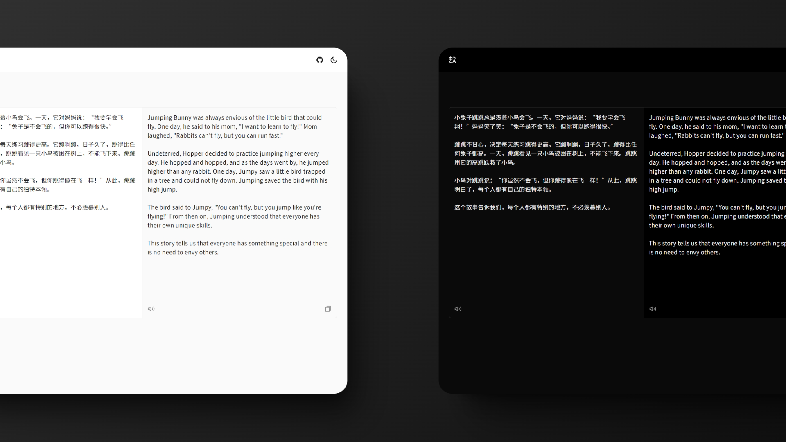

# Translate Web

A simple online translation website developed with **React+TypeScript** and deployed on **Vercel**.  
Very easy and straightforward to use and develop.

## Features

- Chinese to English translation
- TTS (Text to Speech)
- Light / Dark mode

## API Dependencies

- [DeepLX-Serverless](https://github.com/guobao2333/DeepLX-Serverless) API for translation
- [oopstts](https://oopstts.vercel.app/) API for text-to-speech functionality

## License

This project is licensed under the MIT License - see the [LICENSE](LICENSE) file for details.
